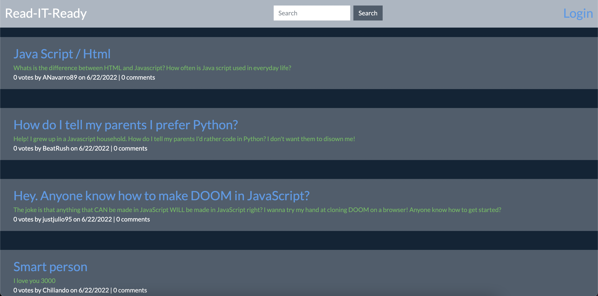

# Read-IT-Ready

## Description
Read-IT-Ready is a forum site where programmers of any skill level can post questions, answer other people's questions, or just show off what they've been doing. In order to make a post or comment, users will need to sign up for a free account, after which they will be able to post as much as they'd like!

## Table of Contents
* [Installation](#Installation)
* [Usage](#Usage)
* [Technologies Used](#Technologies-Used)
* [Preview](#Preview)
* [Deployed](#Deployed)

## Installation 
To install the necessary dependencies, run the following command:

`npm i`

## Usage
* Sign up for an account on the login/signup page
* Once directed to your user dashboard, feel free to make a post or leave a comment on someone else's post. 

## Technologies-Used
* Express
* Handlebars.JS
* MySQL
* BootStrap
* Sequelize
* Express Sessions
* JavaScript

## Preview

## Deployed
https://fast-island-78974.herokuapp.com/